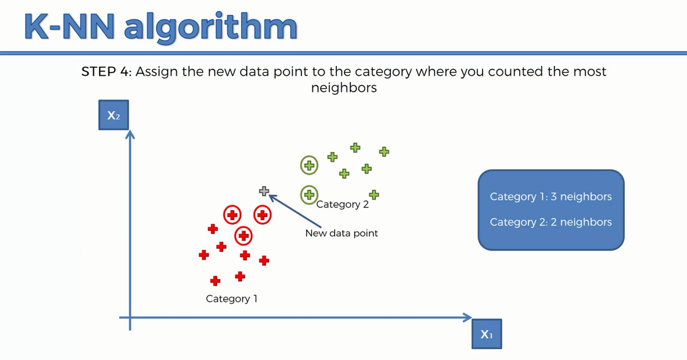

# K-Nearest-Neighbor

Before diving deep into the K-NN let's understand this with a simple example where we have two sets as shown below one is red while another set is green. Now imagine if we take a new value then the question arises which category this new data point would belong. This is where the k nearest algorithm comes in to assist us to find it. 

Step 1: Choose the number K of neighbors.  
Step 2: Take the K nearest neighbor of the new data point, according to the Euclidean distance(It is defined as the distance between two points d=sqrt((x2-x1)^2+(y2-y1)^2)). 
Step 3: Among these K neighbors, count the number of data points in each category(i.e how many data point falls into one category). 
Step 4: Assign the new data points to the category where you counted the most neighbors. 
Step 5: The model is ready. 

